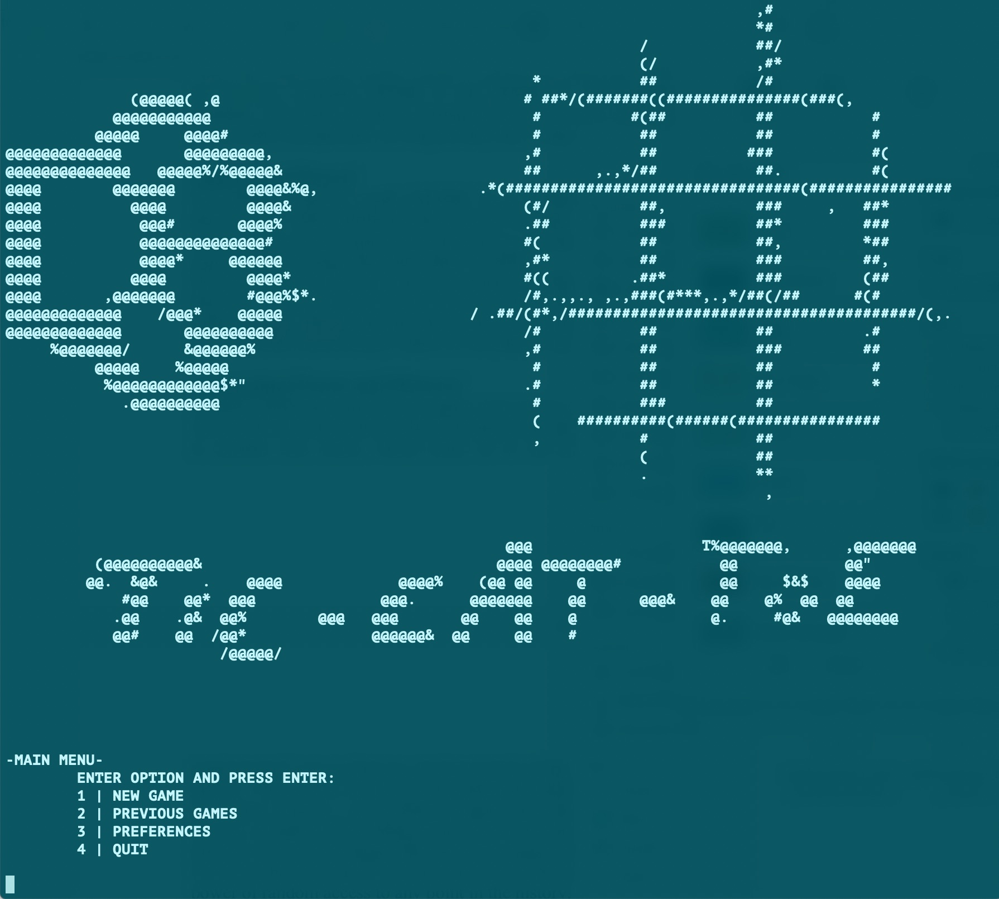
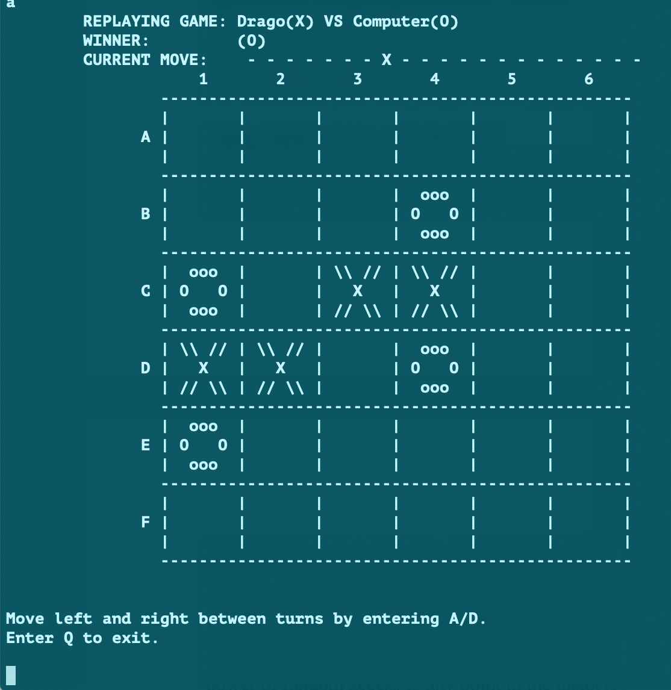

# varga_zsolt_ads
Tic-Tac-Toe implemented in C for Algorithms and Data Structures module at Edinburgh Napier University

To play, navigate into the executable folder and run play from the terminal/command line
The compilable sourcecode can be found in the sourcecode folder.

## To read more about the development and the software look inside the report directory

